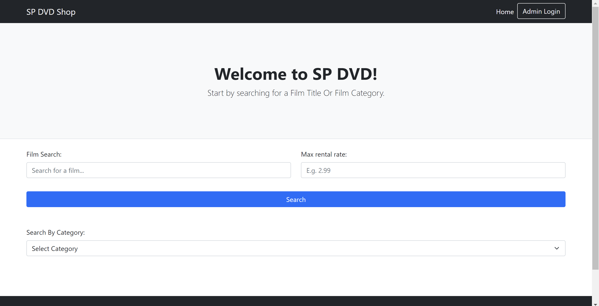
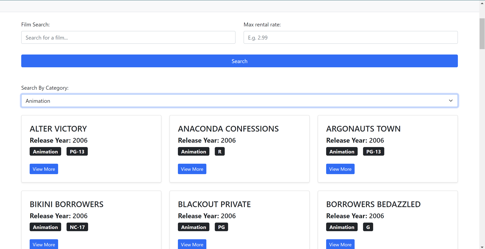
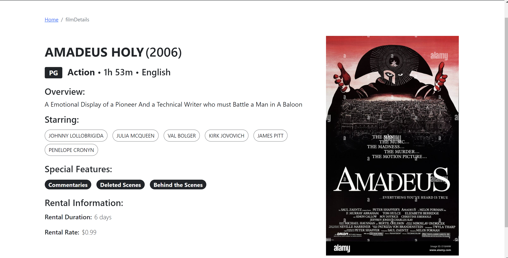
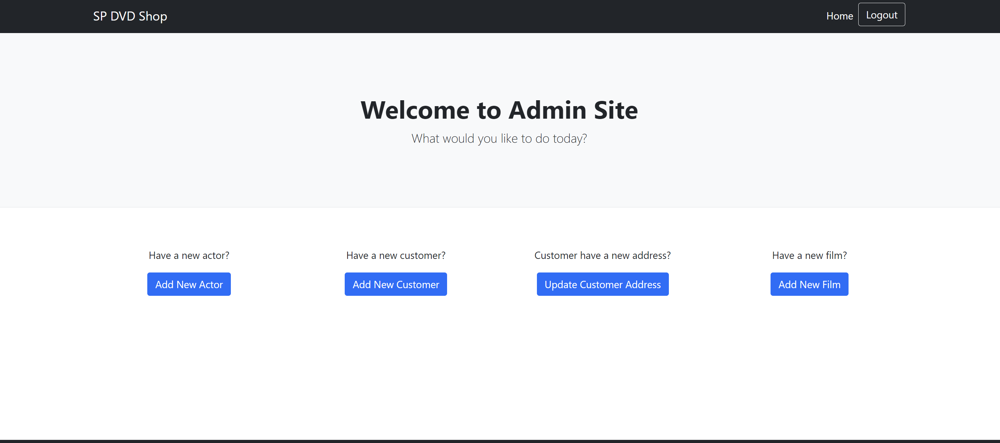

# BED_CA

A DVD store that shows users what dvd they can rent, the website shows the rating, cost, Age Rating, description and etc.

Instructions:

1. Import Database Data from the "sql" folder under the folder Server/sql/BED_CA2_Database.

   - Added a "role" column in Staff table to differentiate between admin and staff, with extra values in the table
   - Added a "image" column in Film table to store the image name when adding new film

2. Make sure that your db.config file under the "config" folder is able to connect to the database with the right username and password.
   Username: bed_dvd_root
   Password: pa$$woRD123
   Note: Make sure that the user is given admin privileges in the database.

3. Make sure that you have the following libraries installed in the respective folders.
   a. Server -> "npm install express mysql body-parser cors jsonwebtoken multer path"
   b. Client -> "npm install express local-storage path"

4. Open 2 terminal tabs, CD into the respective folders and run using nodemon.
   a. Server -> "nodemon server.js"
   b. Client -> "nodemon index.js"

5. Your Client Side should be running now where the Host Link is "http://localhost:3001".

## Snippets of how the website looks like:

### Homepage

### Search Results

### DVD Info Page

### Admin Page

